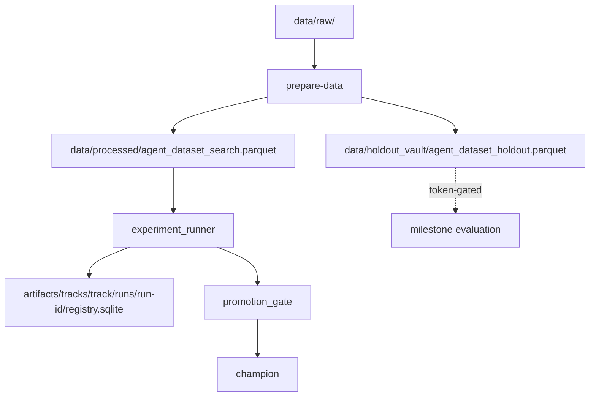
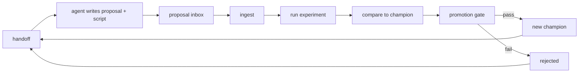

# Insurance AutoResearch

Autonomous insurance target-modelling research loop on freMTPL2, driven by an LLM agent (Claude Code or Codex). Burning cost is the default target; claim frequency can be selected explicitly with `--target-mode frequency` or `evaluation.target_mode = "frequency"`.

[](https://github.com/Alexjhood/Insurance_AutoResearch/actions/workflows/ci.yml) [](https://www.python.org/) [](LICENSE)

## System Overview



## What This Is / Is Not

**What this is:**

- A reproducible local Python environment for iterative insurance target-model improvement
- An autonomous research loop where an LLM agent proposes, runs, and evaluates experiments
- A rigorous actuarial evaluation harness with exposure-weighted Gini as the promotion metric

**What this is not:**

- A production pricing system
- A hosted service
- A benchmark of one specific model

## Requirements

- Python 3.11+
- ~2 GB free disk space
- macOS or Linux (Windows via WSL)

## Quickstart

```bash
git clone https://github.com/Alexjhood/Insurance_AutoResearch.git
cd Insurance_AutoResearch
python3 -m venv .venv && source .venv/bin/activate
pip install -e ".[dev]"
python scripts/generate_synthetic_data.py
autoresearch --track demo --run-id quickstart bootstrap-track
autoresearch --track demo --run-id quickstart start-session quickstart
autoresearch --track demo --run-id quickstart run-session-cycles 1
```

You should see a comparison report under `artifacts/tracks/demo/runs/quickstart/iterations/`.

> **Supported installation mode:** editable install from a source checkout
> (`pip install -e`). The runtime resolves `configs/`, `docs/`, and data/artifact
> directories relative to the repository root, so wheel-based installs outside a
> checkout are not supported. This is a local research tool, not a hosted service.

To inspect results in a browser:

```bash
streamlit run src/autoresearch/dashboard/app.py
```

## Run with an Agent

### Claude Code

See [`docs/RUN_WITH_CLAUDE_CODE.md`](docs/RUN_WITH_CLAUDE_CODE.md) for full setup instructions.

Prerequisites: Claude Code installed and the quickstart above completed. Open the repo:

```bash
cd <repo> && claude
```

Paste the first prompt from `docs/RUN_WITH_CLAUDE_CODE.md`. The agent reads
[`AGENT.md`](AGENT.md) and drives the research loop autonomously.

### Codex

See [`docs/RUN_WITH_CODEX.md`](docs/RUN_WITH_CODEX.md) for Codex-specific instructions.

The `.codex/config.toml` is pre-configured with `sandbox_mode = "workspace-write"` and
`network_access = true`. Network access is required for the OpenML data fetch.

## Agent Loop



## Repo Layout

```text
Insurance_AutoResearch/
├── artifacts/
├── configs/
├── data/
│   ├── processed/
│   ├── raw/
│   └── holdout_vault/
├── docs/
├── scripts/
├── src/
│   └── autoresearch/
└── tests/
```

Tracked run layout under `artifacts/`:

```text
artifacts/tracks/<track>/runs/<run-id>/
  registry.sqlite
  RESEARCH_LOG.md
  run_manifest.json
  context/
  handoffs/
  proposal_inbox/
  proposal_processed/
  results/
  iterations/
    000_bootstrap/
    001_<proposal-id>/
      proposal/
      experiment/
      comparison/
```

## Working with Real freMTPL2 Data

Run `python scripts/fetch_fremtpl2.py` to download ~678K rows from OpenML.
Then run `autoresearch prepare-data` to build the processed datasets.
Licensing: freMTPL2 is subject to CASdatasets / OpenML terms; see [`data/raw/README.md`](data/raw/README.md).

## Where to Go Next

- [`docs/CLI.md`](docs/CLI.md) — full command reference
- [`docs/architecture.md`](docs/architecture.md) — system design
- [`AGENT.md`](AGENT.md) — operating manual the agent reads
- [`CONTRIBUTING.md`](CONTRIBUTING.md) — development guide
- Streamlit dashboard: `streamlit run src/autoresearch/dashboard/app.py`

## License

MIT. See `LICENSE`.
