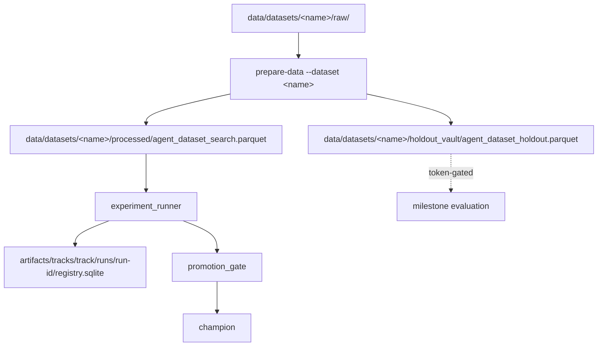
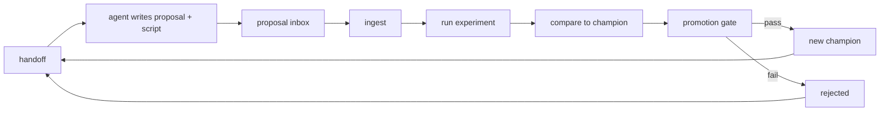

# Insurance AutoResearch

Autonomous tabular target-modelling research loop driven by an LLM agent (Claude Code or Codex). Runs against any registered dataset, selected per run with `--dataset` (built-ins: `french_motor` — the default, `allstate`, `allstate_full`, `porto_seguro`). Each dataset declares its own target modes (e.g. French burning cost / frequency / severity; Porto claim incidence); pick one with `--target-mode` or use the dataset's default. See `autoresearch list-datasets` and the Datasets chapter of [`docs/OPERATING_MANUAL.md`](docs/OPERATING_MANUAL.md).

[](https://github.com/Alexjhood/Insurance_AutoResearch/actions/workflows/ci.yml) [](https://www.python.org/) [](LICENSE)

## System Overview


```mermaid
flowchart TD
    A["data/datasets/&lt;name&gt;/raw/"] --> B["prepare-data --dataset &lt;name&gt;"]
    B --> C["data/datasets/&lt;name&gt;/processed/agent_dataset_search.parquet"]
    B --> D["data/datasets/&lt;name&gt;/holdout_vault/agent_dataset_holdout.parquet"]
    C --> E["experiment_runner"]
    E --> F["artifacts/tracks/track/runs/run-id/registry.sqlite"]
    E --> G["promotion_gate"]
    G --> H["champion"]
    D -. "token-gated" .-> I["milestone evaluation"]
```

## What This Is / Is Not

**What this is:**

- A reproducible local Python environment for iterative insurance target-model improvement
- An autonomous research loop where an LLM agent proposes, runs, and evaluates experiments
- A rigorous actuarial evaluation harness with weight-weighted Gini as the promotion metric
- Multi-dataset: any tabular regression dataset can be registered via a `configs/datasets/<name>.toml` file

**What this is not:**

- A production pricing system
- A hosted service
- A benchmark of one specific model

## Requirements

- Python 3.11+
- ~2 GB free disk space
- macOS or Linux (Windows via WSL)

## Quickstart

```bash
git clone https://github.com/Alexjhood/Insurance_AutoResearch.git
cd Insurance_AutoResearch
python3 -m venv .venv && source .venv/bin/activate
pip install -e ".[dev]"
python scripts/generate_synthetic_data.py
autoresearch --track demo --run-id quickstart bootstrap-track \
  --model-provider demo --model-name local
autoresearch --track demo --run-id quickstart start-session quickstart
autoresearch --track demo --run-id quickstart run-session-cycles 1
```

You should see a comparison report under `artifacts/tracks/demo/runs/quickstart/iterations/`.

> **Supported installation mode:** editable install from a source checkout
> (`pip install -e`). The runtime resolves `configs/`, `docs/`, and data/artifact
> directories relative to the repository root, so wheel-based installs outside a
> checkout are not supported. This is a local research tool, not a hosted service.

To inspect results in a browser:

```bash
streamlit run src/autoresearch/dashboard/app.py
```

The dashboard includes a **Memory & Leaderboard** page (score-trace chart, four ranked leaderboard tabs). Populate it first with `autoresearch memory harvest --all`.

## Run with an Agent

### Claude Code

See [`docs/RUN_WITH_CLAUDE_CODE.md`](docs/RUN_WITH_CLAUDE_CODE.md) for full setup instructions.

Prerequisites: Claude Code installed and the quickstart above completed. Open the repo:

```bash
cd <repo> && claude
```

Paste the first prompt from `docs/RUN_WITH_CLAUDE_CODE.md`. The agent reads the
compact [`AGENT.md`](AGENT.md) runtime contract and drives the research loop
autonomously.

### Codex

See [`docs/RUN_WITH_CODEX.md`](docs/RUN_WITH_CODEX.md) for Codex-specific instructions.

The `.codex/config.toml` is pre-configured with `sandbox_mode = "workspace-write"` and
`network_access = true`. Network access is required for the OpenML data fetch.

## Agent Loop


```mermaid
flowchart LR
    A["handoff"] --> B["agent writes proposal + script"]
    B --> C["proposal inbox"]
    C --> D["ingest"]
    D --> E["run experiment"]
    E --> F["compare to champion"]
    F --> G["promotion gate"]
    G -- "pass" --> H["new champion"]
    G -- "fail" --> I["rejected"]
    H --> A
    I --> A
```

## Repo Layout

```text
Insurance_AutoResearch/
├── artifacts/
│   ├── tracks/<track>/runs/<run-id>/   # per-run isolated artifacts
│   ├── tracks/.scope/                  # run-scope guard: per-session bindings + log (gitignored)
│   └── memory/                         # cross-run aggregator (memory.sqlite, playbook/)
├── configs/
├── data/
│   ├── processed/
│   ├── raw/
│   └── holdout_vault/
├── docs/
├── scripts/
├── src/
│   └── autoresearch/
└── tests/
```

Tracked run layout under `artifacts/`:

```text
artifacts/tracks/<track>/runs/<run-id>/
  registry.sqlite
  RESEARCH_LOG.md
  run_manifest.json
  context/
  handoffs/
  proposal_inbox/
  proposal_processed/
  results/
  iterations/
    000_bootstrap/
    001_<proposal-id>/
      proposal/
      experiment/
      comparison/
```

### Run isolation

Runs are kept independent. A research session is confined to its own run folder by a harness-level **run-scope guard** wired into all three agent harnesses (Claude Code, Codex, OpenCode): run artifacts are blocked before bootstrap, and once the session bootstraps it is bound to that run and cannot read any other run's files. Launch a deliberate cross-run analysis session with `AUTORESEARCH_SCOPE=analyst`. See [`docs/architecture.md`](docs/architecture.md) -> *Run-Scope Guard*.

## Datasets

Every dataset lives under `data/datasets/<name>/{raw,processed,metadata,splits,holdout_vault}/`
and is described by `configs/datasets/<name>.toml` (columns, weight/exposure,
target modes, capping, split grouping, optional sampling). Select one per run:

```bash
autoresearch list-datasets                                  # registered datasets + prepared status
autoresearch --dataset porto_seguro prepare-data            # build a dataset's artifacts
autoresearch --track claude --new-run bootstrap-track \
  --dataset porto_seguro --cycles 10 ...                    # pin a run to a dataset
```

The dataset is pinned in the run manifest — later commands on that run don't
need `--dataset`. Built-ins: `french_motor` (default; exposure + freq/sev),
`allstate` (~2M-row household-stratified sample), `allstate_full` (13.2M rows,
enlarged compute budgets), `porto_seguro` (binary claim incidence). Adding a
dataset = drop a TOML (plus a loader adapter only if the raw shape needs one);
see the Datasets chapter of `docs/OPERATING_MANUAL.md`.

### Real freMTPL2 data

Run `python scripts/fetch_fremtpl2.py` to download ~678K rows from OpenML into
`data/datasets/french_motor/raw/`, then `autoresearch prepare-data`.
Licensing: freMTPL2 is subject to CASdatasets / OpenML terms; see [`data/raw/README.md`](data/raw/README.md).

## Where to Go Next

- [`docs/CLI.md`](docs/CLI.md) — full command reference
- [`docs/architecture.md`](docs/architecture.md) — system design
- [`AGENT.md`](AGENT.md) — compact runtime contract the agent reads (generated by `scripts/generate_agent_contract.py`)
- [`docs/OPERATING_MANUAL.md`](docs/OPERATING_MANUAL.md) — full human operating manual
- [`CONTRIBUTING.md`](CONTRIBUTING.md) — development guide
- Streamlit dashboard: `streamlit run src/autoresearch/dashboard/app.py`

## License

MIT. See `LICENSE`.
